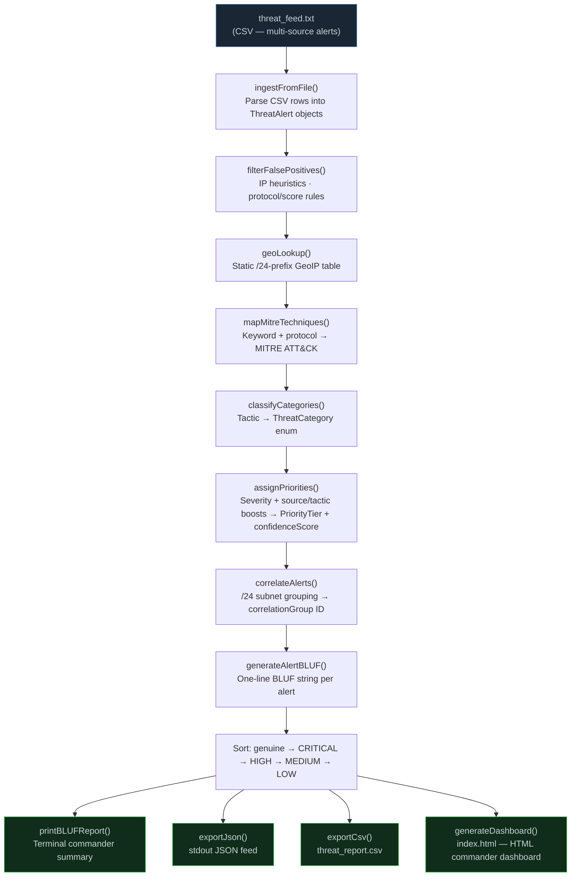

# Architecture

## System Architecture

The system is a self-contained **single-process C++17 pipeline**. There are no servers, no databases, no network calls, and no external runtime dependencies. The entire system compiles to a single binary that reads one input file and writes four output artefacts.



---

## Components

| Component | File(s) | Responsibility |
|---|---|---|
| **Data Model** | `src/ThreatAlert.h` | Defines `ThreatAlert` (alert record), `MitreTechnique` (ATT&CK struct), `ThreatCategory` enum, `PriorityTier` enum |
| **Pipeline Engine** | `src/AlertManager.h` | Declares `AlertManager` class — owns the alert vector, stats, and all 7 pipeline steps |
| **Pipeline Implementation** | `src/main.cpp` | Implements all `AlertManager` and `ThreatAlert` methods; contains `main()` entry point |
| **Threat Feed** | `src/threat_feed.txt` | Sample multi-source alert feed (20 entries across SIEM, Satellite, Cyber Sensor, Intel Report) |
| **HTML Dashboard** | `index.html` *(runtime output)* | Dark-theme commander dashboard — generated fresh on each run by `generateDashboard()` |
| **CSV Export** | `threat_report.csv` *(runtime output)* | Full enriched alert table — generated by `exportCsv()` |
| **SOC Triage UI** | `src/soc-triage.html` | Static hand-crafted companion page for analyst-side triage view (open directly in browser) |

---

## Data Flow

1. **Input** — The binary opens `threat_feed.txt` (or a custom file passed as `argv[1]`). Each non-comment CSV line is parsed into a `ThreatAlert` object and pushed into `AlertManager::alerts`.

2. **False Positive Suppression** — `filterFalsePositives()` iterates all alerts and marks `isFalsePositive = true` on loopback, RFC-1918, low-severity UDP/ICMP, and known-benign resolver IPs. Marked alerts are carried through the pipeline but skipped by all enrichment steps.

3. **GeoIP Enrichment** — `geoLookup()` matches the source IP's first three octets against a 15-entry static table (covering common threat-actor IP ranges in Russia, China, Netherlands, Ukraine, Venezuela, and the US). Private/loopback ranges return `"Private Network"` / `"Loopback"`.

4. **MITRE ATT&CK Mapping** — `mapMitreTechniques()` applies a priority-ordered if/else chain of keyword matches on the lower-cased description and protocol. The first matching rule wins. Covers 9 technique families with protocol-based fallback rules.

5. **Category Classification** — `classifyCategories()` maps the assigned tactic string to a `ThreatCategory` enum value used for display and filtering.

6. **Priority & Confidence Scoring** — `assignPriorities()` computes:
   ```
   confidence = min(1.0, severity/100 + sourceBoost + tacticBoost)
   ```
   Priority tier thresholds (severity-based with confidence gate for CRITICAL):
   - `CRITICAL`: severity ≥ 85 AND confidence ≥ 0.80
   - `HIGH`: severity ≥ 60
   - `MEDIUM`: severity ≥ 35
   - `LOW`: severity < 35

7. **Campaign Correlation** — `correlateAlerts()` builds an `ipGroups` map. For each genuine alert, it checks for an exact IP match first, then a /24 subnet match. Alerts from the same infrastructure block share a `correlationGroup` integer ID. Distinct group count is stored in `ProcessingStats`.

8. **BLUF Generation** — `generateAlertBLUF()` composes a one-line human-readable sentence per alert embedding: priority tier, category, source IP, geo tag, protocol, MITRE technique ID/name, and confidence percentage.

9. **Output** — The pipeline calls four export functions in sequence, writing to stdout (BLUF report + JSON) and disk (`threat_report.csv`, `index.html`).

---

## Class Diagram

```
┌──────────────────────────────────────────┐
│              ThreatAlert                 │
├──────────────────────────────────────────┤
│ id, sourceIP, destinationIP              │
│ protocol, severityScore, timestamp       │
│ sourceType, description                  │
│ ── enriched ──                           │
│ isFalsePositive, confidenceScore         │
│ category: ThreatCategory                 │
│ priority: PriorityTier                   │
│ mitreTechnique: MitreTechnique           │
│ geoCountry, blufLine, correlationGroup   │
├──────────────────────────────────────────┤
│ + toJson() : string                      │
│ + priorityLabel() : string               │
│ + categoryLabel() : string               │
│ + priorityRank() : int                   │
└──────────────────────────────────────────┘

┌──────────────────────────────────────────┐
│             AlertManager                 │
├──────────────────────────────────────────┤
│ - alerts: vector<ThreatAlert>            │
│ - stats: ProcessingStats                 │
├──────────────────────────────────────────┤
│ + addAlert()                             │
│ + ingestFromFile(filename) : bool        │
│ + processAlerts()                        │
│ + getStats() : ProcessingStats&          │
│ + exportJson()                           │
│ + exportCsv(filename)                    │
│ + generateDashboard(filename)            │
│ + printBLUFReport()                      │
│ ── private pipeline ──                   │
│ - filterFalsePositives()                 │
│ - mapMitreTechniques()                   │
│ - classifyCategories()                   │
│ - assignPriorities()                     │
│ - correlateAlerts()                      │
│ - generateAlertBLUF()                    │
│ - geoLookup(ip) : string                 │
└──────────────────────────────────────────┘

┌──────────────────────────┐
│      MitreTechnique      │
├──────────────────────────┤
│ techniqueId : string     │
│ name        : string     │
│ tactic      : string     │
└──────────────────────────┘

┌──────────────────────────┐
│     ProcessingStats      │
├──────────────────────────┤
│ totalIngested            │
│ genuineThreats           │
│ falsePositives           │
│ criticalCount            │
│ highCount / mediumCount  │
│ lowCount                 │
│ correlationGroups        │
└──────────────────────────┘
```

---

## Security Considerations

- **No secrets or credentials required** — the system reads only a local CSV file and writes local files. There are no API keys, tokens, or network connections of any kind.
- **No external code execution** — zero dynamic linking beyond the C++ standard library. The binary is fully auditable from a single `main.cpp` source file.
- **No `.env` file needed** — the `.env.example` in `src/` is a template artefact from the project scaffold; this project does not use environment variables.
- **Input sanitisation** — all CSV fields are whitespace-trimmed and integer parsing is wrapped in a try/catch. Malformed lines are logged and skipped without crashing the pipeline.
- **HTML output escaping** — `jsonEscape()` sanitises all alert string fields before embedding them in JSON output, preventing injection into downstream JSON consumers.

---

## Scalability Notes

The current implementation is intentionally minimal for the hackathon prototype. Paths to production scale:

| Bottleneck | Scaling Path |
|---|---|
| **Single-threaded pipeline** | Parallelise stages 2–6 with `std::async` / thread pool; alerts are independent within each stage |
| **Static GeoIP table** | Replace `geoLookup()` with MaxMind GeoLite2 MMDB reader (C API, no extra runtime) |
| **Keyword-based MITRE mapping** | Train a lightweight text classifier (e.g., fastText) on ATT&CK technique descriptions and ship as a static model file |
| **Static CSV ingestion** | Add a streaming ingestion adapter that reads from a UNIX socket, Kafka topic, or SIEM syslog forward |
| **No persistence** | Add an SQLite backend (single-file, zero-install) for historical trend analysis and deduplication across runs |
| **Alert volume > 100k** | Introduce a pre-filter bloom filter on source IP to skip known-safe IPs before full pipeline processing |
